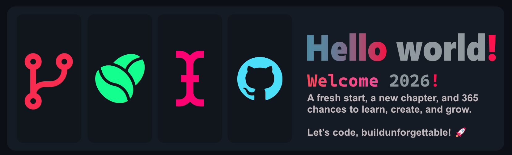

# 🍀Greetings form InterCentury
Aka Maruf Hasan

## 🎯 Core Interests

- **System Programming** – low-level development, OS-level tools, and performance-oriented coding  
- **Hardware & OS Information Retrieval** – building tools to extract and visualize system info  
- **Cross-Platform Tool Development** – designing software that works seamlessly across Windows, Linux, and other environments  
- **Linux Tinkering & Desktop Customization** – exploring distros, optimizing workflows, and personalizing environments  
- **Clean Code Design** – writing maintainable, readable, and performance-focused code  

---

## 🛠️ Skills & Experience

- **Programming Languages:** C++, Python  
- **Game Engine & Tools:** Unreal Engine (experience building interactive projects)  
- **Projects:**  
  - **BinaryFetch** – a system information tool built in C++  
  - **Interscan** – another C++ project focused on [brief description]  
- **Software & Tools:** Visual Studio, VS Code, PyCharm, Unreal Engine, Code::Blocks, Git, GitHub, Figma, Terminal/Shell scripting  

---

## 🌱 Learning & Growth

I am deeply interested in **continuous learning** and actively exploring new technologies. My focus is on **building meaningful software, contributing to open source projects**, and improving my understanding of system-level programming and performance optimization.

---

## 🔧 Tools & Environment

| Category | Tools |
|----------|-------|
| IDE / Code Editors | Visual Studio, VS Code, PyCharm, Code::Blocks |
| Design / UI | Figma, Adobe XD |
| Game Dev | Unreal Engine |
| Version Control | Git, GitHub |
| Terminal & CLI | Windows Terminal, Linux Shell |
|OS| Windown, Arch Linux, Ubuntu, EndavourOS|

---

## 👻 About Me

- Age: 16  
- Education: Class/Grade 10th  
- Location: Dhaka, Bangladesh  
- Core Philosophy: **Continuous learning, meaningful software development, open source contribution**  

I strive to create tools and projects that **not only solve problems but also improve workflows** and help the developer community. My journey is just beginning, and I aim to grow through hands-on experience, experimentation, and collaboration.

<table>
  <tr>
    <td>
      <!-- GitHub Stats -->
      
       
      
       
      
    </td>
    <td>
      <!-- Top Contributed Repo -->
      
       
      <!-- Visitor Count -->
      
    </td>
  </tr>
</table>

## 🚀 Let's Connect

-  
- [LinkedIn](https://www.linkedin.com/in/YourLinkedIn) *(optional)*  
- [Portfolio / Projects](#) *(optional)*  

---

*“Code is not just lines of text; it’s a reflection of thought, problem-solving, and creativity. I aim to build software that matters.”* ✨
